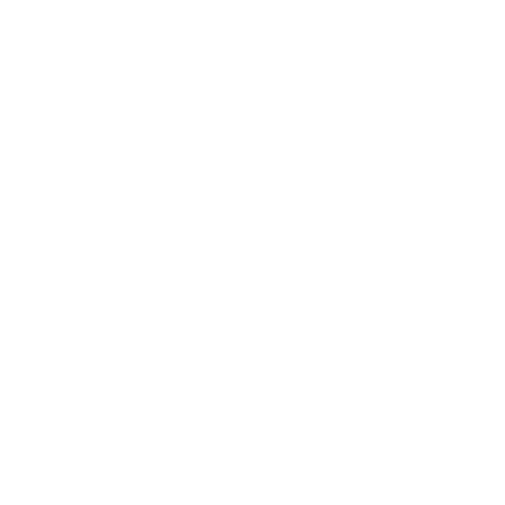
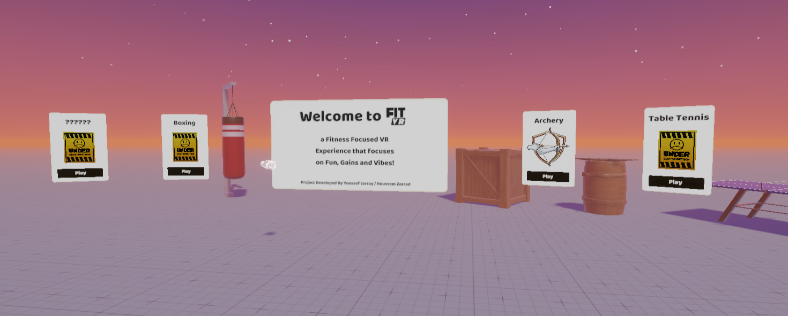

<div align="center">

<!-- Replace the URL below with your actual logo image -->


# **FitVR**

**Immersive fitness experiences powered by virtual reality**

[](https://unity.com/)
[](https://github.com/)
[](LICENSE)
[](https://github.com/SoliderBoy20xx/fitvr/issues)
[](https://github.com/SoliderBoy20xx/fitvr/stargazers)
[](CONTRIBUTING.md)

<!-- Replace with a banner/preview image of your app -->


[About](#about) · [Features](#features) · [Getting Started](#getting-started) · [Architecture](#architecture) · [Development Standards](#development-standards) · [Contributing](#contributing)

</div>

---

## About

**FitVR** is a multiplayer virtual reality fitness platform built in Unity 6. It combines immersive mini-games with real workout routines, letting users exercise together in shared virtual environments — making fitness social, fun, and effective.

> [!IMPORTANT]
> FitVR is a school project. All assets used are property of their respective owners. You may not edit, modify, or distribute this code without prior authorization.


---

## Features

- 🥊 **VR Mini-Games** — Engaging fitness activities designed around natural body movement
- 🌐 **Multiplayer Lobby** — Join sessions with multiple simultaneous users in shared virtual spaces
- 🔐 **Secure Authentication** — Encrypted user data and secure login flows
- ⚡ **High-Performance** — Optimized for low latency and high frame rates essential for VR comfort
- 🧩 **Modular Architecture** — Clean separation of Core, MiniGames, Lobby, and Services modules

---

## Getting Started

### Prerequisites

- Unity **6000.3.8f1** (Unity 6.3 LTS)
- Git

### Installation

**1. Clone the repository**

```bash
git clone https://github.com/SoliderBoy20xx/fitvr.git
cd fitvr
```

Or, if you have existing files:

```bash
git init
git remote add origin https://github.com/SoliderBoy20xx/fitvr.git
```

**2. Open in Unity**

Open Unity Hub → **Add project from disk** → select the cloned folder → open with Unity **6000.3.8f1**.

**3. Create a working branch**

Always work on a new branch — never commit directly to `main`:

```bash
git checkout -b feature/your-feature-name
```

---

## Architecture

FitVR uses a **modular architecture** with strict dependency rules to keep the codebase maintainable and scalable.

```
┌─────────────────────────────────────────────┐
│                  Core                        │
│   (shared systems, utilities, interfaces)    │
└───────────────┬──────────┬──────────────────┘
                │          │          │
        ┌───────▼──┐  ┌────▼───┐  ┌──▼──────┐
        │MiniGames │  │ Lobby  │  │Services │
        └──────────┘  └────────┘  └─────────┘
```

### Dependency Rules

| Dependency              | Status      |
|-------------------------|-------------|
| `MiniGames` → `Core`    | ✅ Allowed  |
| `Lobby` → `Core`        | ✅ Allowed  |
| `Services` → `Core`     | ✅ Allowed  |
| `Core` → any module     | ❌ Prohibited |

> **Rule:** The `Core` module must **never** reference any other module. All shared logic lives in `Core`; other modules may depend on it freely.

---

## Development Standards

### Performance
Maintain high frame rates and low latency at all times. VR comfort depends on consistent rendering — profile regularly and avoid unoptimized allocations in hot paths.

### Stability
Features must support multiple simultaneous users without crashes. Test multiplayer scenarios thoroughly before merging.

### Security
Implement secure authentication and encrypt all user data for every new component touching user accounts or session data.

### Branching
```
main          → stable, production-ready
dev           → integration branch
feature/*     → individual features
fix/*         → bug fixes
```

---

## Contributing

Pull requests are welcome! Please:

1. Branch off `dev`, not `main`
2. Follow the [architecture rules](#architecture) — especially the `Core` constraint
3. Keep performance and multiplayer stability in mind
4. Open an issue first for large changes

---

## License

Distributed under the MIT License. See [`LICENSE`](LICENSE) for details.

---

<div align="center">
  <sub>Built with Unity 6 · Made with ❤️ for fitness and VR</sub>
</div>